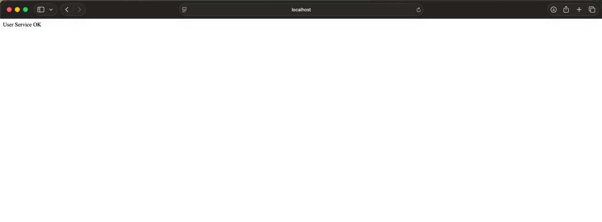
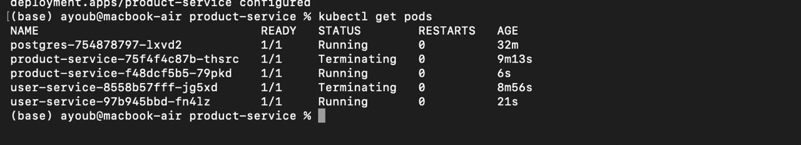
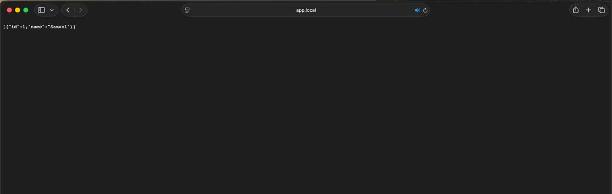
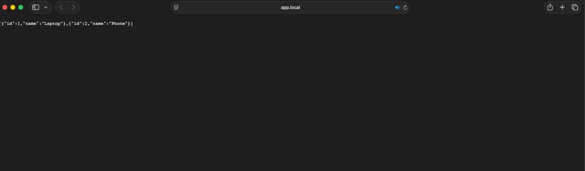
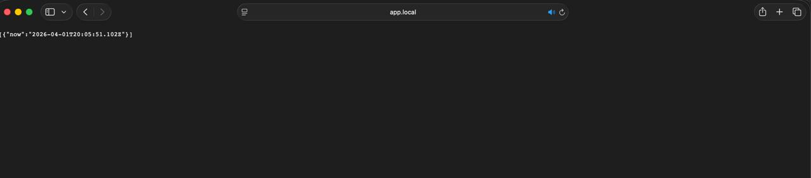
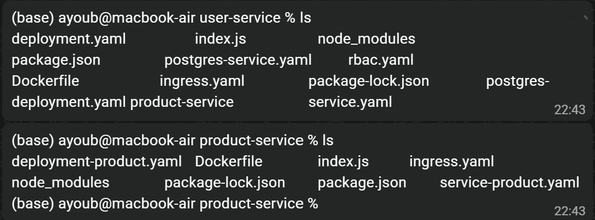

# Microservices Project

## Description

Ce projet présente la mise en place d’une architecture microservices en utilisant Node.js, Docker et Kubernetes (Minikube).

L’objectif est de concevoir, déployer et sécuriser plusieurs services communicants dans un environnement distribué.

---

## 1. Développement d’un microservice

Un premier microservice a été développé avec Node.js (Express).
Ce service expose une API REST simple permettant de vérifier son bon fonctionnement.

### Résultat


Le service répond correctement en local, ce qui valide le bon fonctionnement de l’application avant son déploiement.

---

## 2. Conteneurisation avec Docker

Le microservice a ensuite été conteneurisé avec Docker :

* création d’un Dockerfile
* construction de l’image
* exécution du conteneur

### Résultat



Le service est accessible depuis un conteneur, ce qui garantit sa portabilité.

---

## 3. Déploiement avec Kubernetes

Le service a été déployé dans Kubernetes (Minikube) avec :

* un Deployment pour gérer les pods
* un Service pour exposer l’application

### Résultat



Les pods sont en état *Running*, ce qui confirme le bon déploiement du service dans le cluster.

---

## 4. Mise en place d’une Gateway (Ingress)

Une gateway a été configurée avec Ingress afin de permettre un accès simplifié au service via un nom de domaine.

### Résultat


Le service est accessible via une URL personnalisée sans avoir besoin de spécifier un port.

---

## 5. Ajout d’un second microservice

Un deuxième microservice (product-service) a été développé et déployé.

L’architecture permet désormais de gérer plusieurs services distincts.

### Résultats

#### Service utilisateurs



#### Service produits



Les deux services fonctionnent correctement et sont accessibles via la gateway.

---

## 6. Communication entre microservices

Les microservices communiquent entre eux via le DNS interne de Kubernetes.

```
http://product-service
```

Cette communication permet de construire une architecture distribuée cohérente.

---

## 7. Intégration d’une base de données

Une base de données PostgreSQL a été déployée dans Kubernetes.

Le microservice principal est connecté à cette base afin de stocker et récupérer des données.

### Résultat



Le service retourne des données provenant de la base, ce qui valide l’intégration.

---

## 8. Sécurisation du cluster

Des règles RBAC ont été mises en place afin de contrôler les accès au cluster Kubernetes.

### Résultats

#### Action autorisée


#### Action refusée


Certaines actions sont autorisées tandis que d’autres sont bloquées, ce qui garantit la sécurité des ressources.

---

## 9. Architecture globale

### Structure du projet



### Organisation logique

```
Client → Ingress
        ↓
   user-service → product-service
            ↓
        PostgreSQL
```

---

## 10. Lancement du projet

```
minikube start
kubectl apply -f k8s/
minikube tunnel
```

Configuration du fichier `/etc/hosts` :

```
127.0.0.1 app.local
```

---

## Conclusion

Ce projet met en œuvre une architecture microservices complète en respectant les bonnes pratiques de développement et de déploiement.

Il illustre :

* la création de services REST
* la conteneurisation avec Docker
* l’orchestration avec Kubernetes
* la communication entre services
* l’intégration d’une base de données
* la sécurisation du cluster

---

## Auteurs

Ayoub ERRAHMANI
Samuel DARMALINGON
